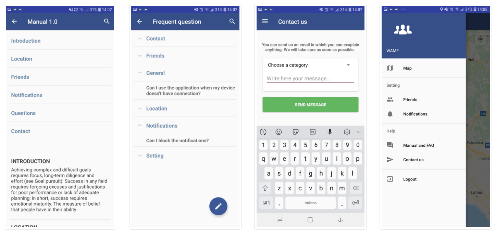

# Mobile Android Application And Cloud Computing
WAMF (Where Are My Friends) is an Android app which allows you to find your friends in a lot of situations. Just share a code.

# Overview 
The user can login with username and password, or can log in with facebook. If you do not have an account you can easily register. Once entered, it inserts a unique reference code for the group of interest and the map is loaded highlighting all the group members through the markers. On each marker (at the click) the name is displayed with relative distance. The user can block / accept notifications and filter them for the distance between people.

# Interface

# Technologies
* Hardware:
  * Android Smartphone
* Software:
  * [Android Studio](https://developer.android.com/studio)
  * [Heroku](https://www.heroku.com/)
  * [Node.js](https://nodejs.org/it/)
  * [Firebase](https://firebase.google.com/)
  * [PostgreSQL](https://www.postgresql.org/)

